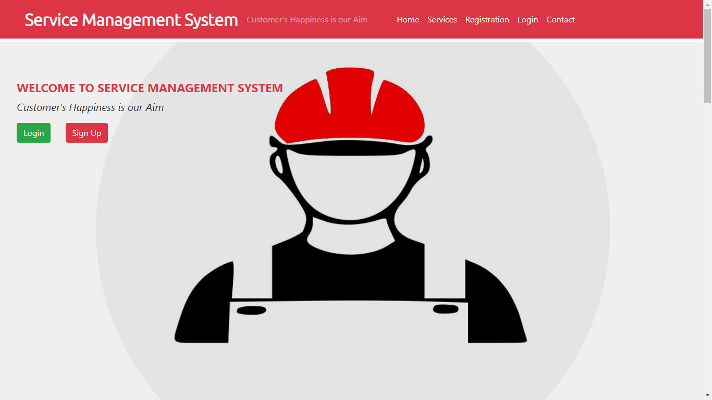
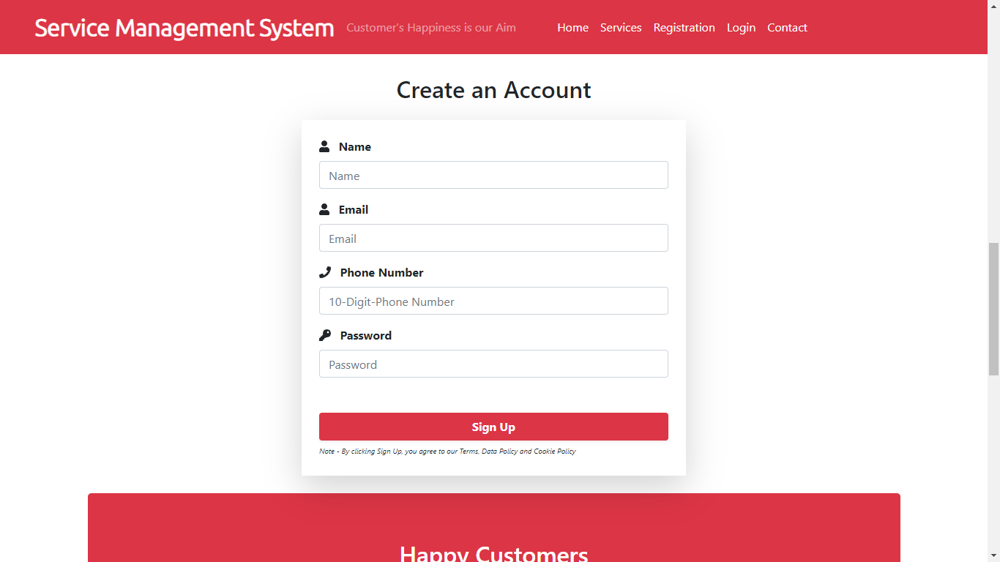
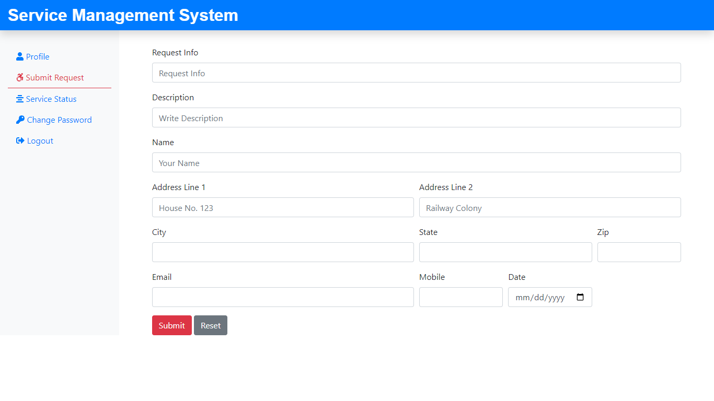
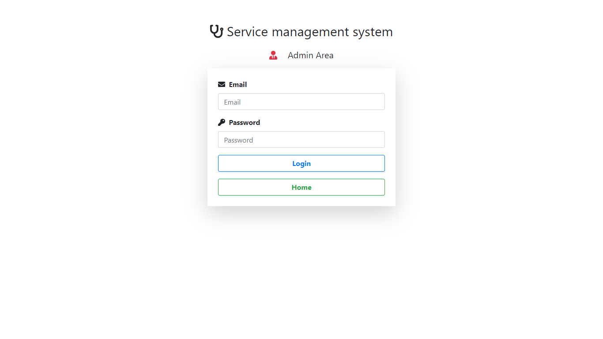

# Service Management System

A web portal that enables users to request services and helps companies assign engineers for those services. It streamlines the service request process, optimizes engineer allocation, and facilitates efficient tracking and communication.

## Screenshots

## Features

- User-friendly interface for service requests
- Efficient engineer assignment based on requirements
- Real-time service status tracking
- Seamless communication between users, engineers, and the company

## Technologies Used

- HTML, CSS, JavaScript for front-end
- PHP for server-side scripting
- MySQL database for data storage
- Bootstrap framework for responsive design

## Usage

1. Clone the repository.
2. Import the database schema.
3. Configure the database connection.
4. Start a local server or deploy the project.
5. Access the application through the browser.

